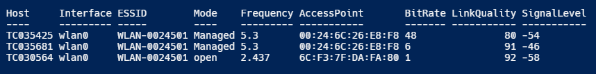
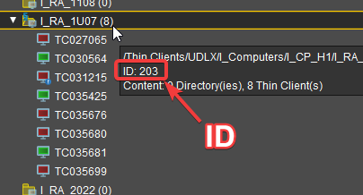

# Get Endpoint WiFi Information via SSH

## Prerequisites

* Module [PSIGEL](https://github.com/IGEL-Community/PSIGEL)
  * interact with the IGEL IMI API / handling of SSH Session Output
* Module [Invoke-Parallel](https://github.com/RamblingCookieMonster/Invoke-Parallel) by Warren Frame aka RamblingCookieMonster
  * run multiple Commands parallel
* Module [Posh-SSH](https://github.com/darkoperator/Posh-SSH) by Carlos Perez aka darkoperator
  * establish SSH-sessions and perform action in them

## Objective

Get Information of WiFi connections from all IGELOS endpoints in a given directory as an object. The information include hostname, interface name, SSID, mode, frequency, connected access point, bit rate, link quality and signal level.



## Implementation

### Use secure credentials

#### Option 1

Export credential via `ConvertFrom-SecureString` to file. Only the password is saved.

```powershell
(Get-Credential).Password | ConvertFrom-SecureString |
  Set-Content 'C:\Credentials\UmsRmdb.cred'
```

Import credential via `ConvertTo-SecureString` from file. Only the password is imported,
the username is provided via variable.

```powershell
$UMSCredPath = 'C:\Credentials\UmsRmdb.cred'
$UMSUser = 'rmdb'
$UMSPassword = Get-Content $UMSCredPath | ConvertTo-SecureString
```

#### Option 2

Export credential via `Export-Clixml` to file. Username and password are saved.

```powershell
Get-Credential | Export-Clixml -Path 'C:\Credentials\TCRoot.cred'
```

Import credential `Import-Clixml` from file. Username and password are imported.

```powershell
$RootCredPath = 'C:\Credentials\TCRoot.cred'
$RootCredential = (Import-Clixml -Path $RootCredPath)
```

## Set the directory of the endpoints to connect to

Here I just specify the ID of the directory. (I could get the ID from the `Get-UMSThinclientDirectory` function
by filtering for its name.)

Get the ID in UMS via mouse-over:



```powershell
[int]$DirID = 203
```

### Set variables - PSDefaultParameterValues

Avoid setting the same parameters for several function calls:

```powershell
$PSDefaultParameterValues = @{
  '*-UMS*:Credential'   = (New-Object System.Management.Automation.PsCredential($UMSUser, $UMSPassword))
  '*-UMS*:Computername' = 'igelrmserver.acme.org'
}
```

Create a session-cookie for the API-Request and setting it to the variable $WebSession:

```powershell
$WebSession = New-UMSAPICookie
```

Expand ```PSDefaultParameterValues``` by $WebSession variable:

```powershell
$PSDefaultParameterValues += @{
  '*-UMS*:WebSession' = $WebSession
}
```

### Get online Endpoints

Get Endpoints from specified directory:

```powershell
$DirColl = (Get-UMSThinclientDirectory -DirID $DirID -Children).DirectoryChildren
```

Get Endpoint Information which includes online status from UMS:

```powershell
$EndPointColl = $DirColl.where{$_.objectType -eq 'tc'}.id | Get-UMSThinclient -Details online
```

Get all online Endpoints in UMS.
*Note: if the WiFi connection is too poor, UMS might not recognize all online Endpoints* :

```powershell
$OnlineEndPointColl = $EndPointColl.Where{$_.online -eq 'True'}
```

### Get WiFi information from the online Endpoints

* Process parallel execution via pipeline with `Invoke-Parallel`:
  * Connect to Endpoint with `New-SSHSession`
  * Get WiFi information from Endpoint with `Get-EPWifiConnection`
  * Disconnect from endpoint with `Remove-SSHSession`, avoiding output

```powershell
$UpdateConfigurationColl = $OnlineEndPointColl |
  Invoke-Parallel -RunspaceTimeout 10 -ScriptBlock {
  $SshSession = New-SSHSession -Computername $_.Name -Credential $Using:RootCredential -AcceptKey
  Get-EPWifiConnection -SSHSession $SshSession
  $null = Remove-SSHSession -SSHSession $SshSession
}
```

### Manipulate and format Output

Pipe output to `Select-Object` and convert property LinkQuality to percentage.
`Sort-Object` for properties LinkQuality, BitRate and SignalLevel:

```powershell
$UpdateConfigurationColl |
  Select-Object Host, Interface, ESSID, Mode, Frequency, AccessPoint, BitRate, @{
  name       = 'LinkQuality'
  expression = { [int]([int]($_.LinkQuality -replace ('/.*', '')) / [int]($_.LinkQuality -replace ('^\d{2,3}/', '')) * 100) }
}, SignalLevel |
  Sort-Object -Property @{
  Expression = {[int]$_.LinkQuality}
}, @{
  Expression = {[int]$_.BitRate}
}, @{
  Expression = {[int]$_.SignalLevel}
} |
  Format-Table -AutoSize
}
```

## Output

Get output as  followed:

```console
Host     Interface ESSID        Mode    Frequency AccessPoint       BitRate LinkQuality SignalLevel
----     --------- -----        ----    --------- -----------       ------- ----------- -----------
TC035425 wlan0     WLAN-0024501 Managed 5.3       00:24:6C:26:E8:F8 48               80 -54
TC035681 wlan0     WLAN-0024501 Managed 5.3       00:24:6C:26:E8:F8 6                91 -46
TC030564 wlan0     WLAN-0024501 open    2.437     6C:F3:7F:DA:FA:80 1                92 -58
```

## Complete script

Download the complete script [here](../Examples/GetEndpointWifiInformation.ps1).
