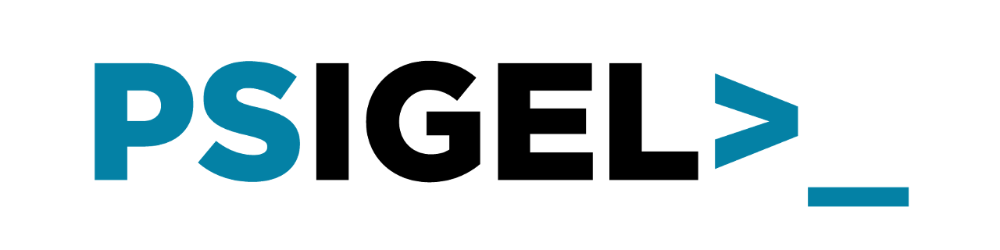

# PSIGEL

[![GitHub last commit][github-commit-badge]][github-psigel]
[![GitHub release (latest by date)][github-release-badge]][github-psigel]
[![PowerShell Gallery Version][psgallery-v-badge]][powershell-gallery]
[![PS Gallery][psgallery-dl-badge]][powershell-gallery]
[![GitHub stars][github-start-badge]][github-psigel]
[![IGEL-Community Slack][slack-badge]][slack-igelcommunity]



## Table of contents

- [Overview](#overview)
- [Prerequisites](#prerequisites)
- [Installation](#installation)
- [Getting Started](#getting-started)
- [Documentation](#documentation)
- [Maintainer](#maintainer)
- [License](#license)

## Overview

**PSIGEL** is a powershell module that makes use of the REST API provided by the [**IGEL**](https://www.igel.com) Management Interface (IMI).

via [IGEL Knowledgebase](https://kb.igel.com/igelimi-v3/en/imi-manual-2723216.html) :
> IGEL Management Interface (IMI) enables you to connect UMS to systems management tools. It is a programming interface that can create and delete thin clients, move them between directories, reboot them and much more. Its implementation as a REST API makes IMI agnostic of hardware platforms, operating systems and programming languages, thus ensuring maximum interoperability.

## Prerequisites

|OS|min. PS Version (Edition)|
|-|-|
|Windows|5.1 (Desktop)\*|
|Windows|7 (Core)\*|
|Linux|7 (Core)\*|
|MacOS|7 (Core)|

\* tested

## Quickstart

### Installation

If you have the [PowerShellGet](https://github.com/powershell/powershellget) module installed you can enter the following command:

```powershell
C:\> Install-Module -Name PSIGEL
```

Alternatively you can download a ZIP file of the latest version from our [Releases](https://github.com/IGEL-Community/PSIGEL/releases) page.

### Basic usage

Import Module:

```powershell
C:\> Import-Module -Name PSIGEL
```

Create a WebSession

```powershell
C:\> $WebSession = New-UMSAPICookie -Computername igelrmserver -Credential (Get-Credential)
```

Call a Function - e.g. get status information from the UMS server:

```powershell
C:\> Get-UMSStatus -Computername igelrmserver -WebSession $WebSession

RmGuiServerVersion : 6.3.130
BuildNumber        : 44584
ActiveMqVersion    : 5.7.0
DerbyVersion       : 10.12.1.1
ServerUuid         : f30fb3a2-37d4-4cbb-b884-4f5061d3260e
Server             : igelrmserver:8443
```

Remove WebSession:

```powershell
C:\> $null = Remove-UMSAPICookie -Computername igelrmserver -WebSession $WebSession
```

## Documentation

- [Scripting with PSIGEL](/Docs/Scripting-with-PSIGEL.md)
  - [Installation](/Docs/Scripting-with-PSIGEL.md#installation)
  - [Setup](/Docs/Scripting-with-PSIGEL.md#setup)
  - [Configuration](/Docs/Scripting-with-PSIGEL.md#configuration)
  - [Authentication](/Docs/Scripting-with-PSIGEL.md#authentication)
  - [Creating a script](/Docs/Scripting-with-PSIGEL.md#creating-a-script)
- Functions
  - [Get-UMSDevice](/Docs/Get-UMSDevice.md)
  - [Get-UMSDeviceAssignment](/Docs/Get-UMSDeviceAssignment.md)
  - [Get-UMSDeviceDirectory](/Docs/Get-UMSDeviceDirectory.md)
  - [Get-UMSDeviceDirectoryAssignment](/Docs/Get-UMSDeviceDirectoryAssignment.md)
  - [Get-UMSDirectoryRecursive](/Docs/Get-UMSDirectoryRecursive.md)
  - [Get-UMSFirmware](/Docs/Get-UMSFirmware.md)
  - [Get-UMSProfile](/Docs/Get-UMSProfile.md)
  - [Get-UMSProfileAssignment](/Docs/Get-UMSProfileAssignment.md)
  - [Get-UMSProfileDirectory](/Docs/Get-UMSProfileDirectory.md)
  - [Get-UMSStatus](/Docs/Get-UMSStatus.md)
  - [Move-UMSDevice](/Docs/Move-UMSDevice.md)
  - [Move-UMSDeviceDirectory](/Docs/Move-UMSDeviceDirectory.md)
  - [Move-UMSProfile](/Docs/Move-UMSProfile.md)
  - [Move-UMSProfileDirectory](/Docs/Move-UMSProfileDirectory.md)
  - [New-UMSAPICookie](/Docs/New-UMSAPICookie.md)
  - [New-UMSDevice](/Docs/New-UMSDevice.md)
  - [New-UMSDeviceDirectory](/Docs/New-UMSDeviceDirectory.md)
  - [New-UMSProfileAssignment](/Docs/New-UMSProfileAssignment.md)
  - [New-UMSProfileDirectory](/Docs/New-UMSProfileDirectory.md)
  - [Remove-UMSAPICookie](/Docs/Remove-UMSAPICookie.md)
  - [Remove-UMSDevice](/Docs/Remove-UMSDevice.md)
  - [Remove-UMSDeviceDirectory](/Docs/Remove-UMSDeviceDirectory.md)
  - [Remove-UMSProfile](/Docs/Remove-UMSProfile.md)
  - [Remove-UMSProfileAssignment](/Docs/Remove-UMSProfileAssignment.md)
  - [Remove-UMSProfileDirectory](/Docs/Remove-UMSProfileDirectory.md)
  - [Reset-UMSDevice](/Docs/Reset-UMSDevice.md)
  - [Restart-UMSDevice](/Docs/Restart-UMSDevice.md)
  - [Send-UMSDeviceSetting](/Docs/Send-UMSDeviceSetting.md)
  - [Start-UMSDevice](/Docs/Start-UMSDevice.md)
  - [Stop-UMSDevice](/Docs/Stop-UMSDevice.md)
  - [Update-UMSDevice](/Docs/Update-UMSDevice.md)
  - [Update-UMSDeviceDirectory](/Docs/Update-UMSDeviceDirectory.md)
  - [Update-UMSProfile](/Docs/Update-UMSProfile.md)
  - [Update-UMSProfileDirectory](/Docs/Update-UMSProfileDirectory.md)
- Other sources
  - [igelexperts.com](https://www.igelexperts.com/category/igel/psigel/)
- [Changelog](CHANGELOG.md)

## Maintainer

- Falk Heiland
[![https://github.com/falkheiland][github-fh-badge]][github-fh]
[![http://twitter.com/falkheiland][twitter-fh-badge]][twitter-fh]

## License

This project is [licensed under the MIT License](LICENSE).

[![MIT licensed][mit-badge]][mit-license]

[psgallery-dl-badge]: https://img.shields.io/powershellgallery/dt/PSIGEL.svg?logo=powershell
[powershell-gallery]: https://www.powershellgallery.com/packages/PSIGEL/
[mit-badge]: https://img.shields.io/github/license/IGEL-Community/PSIGEL?logo=github
[mit-license]: LICENSE
[github-commit-badge]: https://img.shields.io/github/last-commit/IGEL-Community/PSIGEL?logo=github
[github-psigel]: https://github.com/IGEL-Community/PSIGEL
[github-release-badge]: https://img.shields.io/github/release/IGEL-Community/PSIGEL/all.svg?logo=github
[psgallery-v-badge]: https://img.shields.io/powershellgallery/v/PSIGEL?include_prereleases&logo=powershell
[github-start-badge]: https://img.shields.io/github/stars/IGEL-Community/PSIGEL?logo=github
[slack-badge]: https://img.shields.io/badge/chat-IGEL%20Community-brightgreen?logo=slack
[slack-igelcommunity]: https://igelcommunity.slack.com/
[github-fh-badge]: https://img.shields.io/badge/Github-falkheiland-green?logo=github
[github-fh]: https://github.com/falkheiland
[twitter-fh-badge]: https://img.shields.io/badge/Twitter-falkheiland-blue?logo=twitter
[twitter-fh]: https://twitter.com/falkheiland
